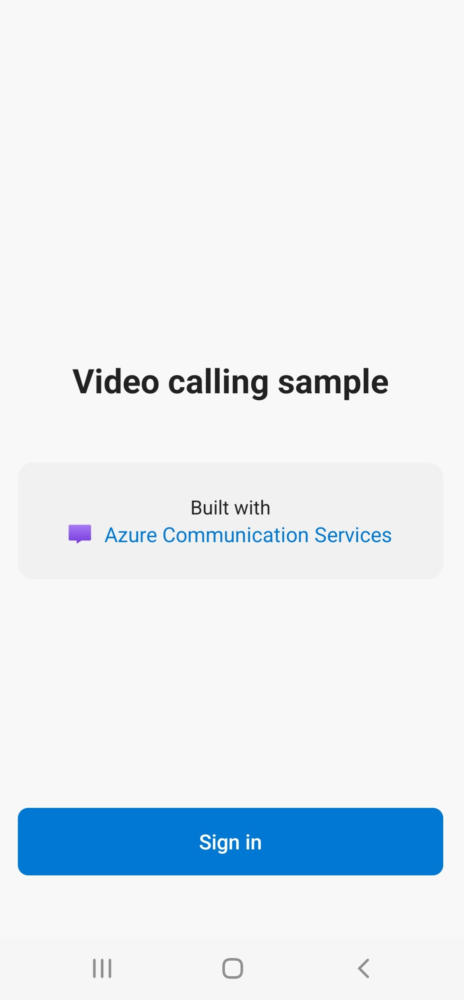

# Group Calling Sample

The sample is a native Android application that uses the Azure Communication Services Android client libraries to build a calling experience that features both voice and video calling. The application uses a server-side component to provision access tokens that are then used to initialize the Azure Communication Services client library. To configure this server-side component, feel free to follow the [Trusted Service with Azure Functions](https://docs.microsoft.com/azure/communication-services/tutorials/trusted-service-tutorial) tutorial.

Additional documentation for this sample can be found on [Microsoft Docs](https://docs.microsoft.com/en-us/azure/communication-services/samples/calling-hero-sample?pivots=platform-android). See this sample's wiki to see updated information on [known issues](https://github.com/Azure-Samples/communication-services-android-calling-hero/wiki/Known-Issues)

A separate version of the Calling Sample is available with **Teams Interop** support ([Teams Interop Sample](https://github.com/Azure-Samples/communication-services-android-calling-hero/tree/feature/teams_interop)). Teams Interop is currently in **Public Preview**. Please use the main branch sample for any production scenarios.

## Features

- Start a new group call
- Join an existing group call
- Render remote participant video streams dynamically
- Switch layout between different call cases: only-local video view, one-on-one call view and group call with multiple participants
- Turning local video stream from camera on/off
- Mute/unmute local microphone audio



## Prerequisites

- An Azure account with an active subscription. [Create an account for free](https://azure.microsoft.com/free/?WT.mc_id=A261C142F).
- An OS running [Android Studio](https://developer.android.com/studio).
- A deployed Communication Services resource. [Create a Communication Services resource](https://docs.microsoft.com/azure/communication-services/quickstarts/create-communication-resource).
- An Authentication Endpoint that will return the Azure Communication Services Token. See [example](https://docs.microsoft.com/azure/communication-services/tutorials/trusted-service-tutorial)

## Before running the sample for the first time

1. Open Android Studio and select `Open an Existing Project`.
2. Select folder `AzureCalling`.
3. Expand app/assets to update `appSettings.properties`. Set the value for the key `communicationTokenFetchUrl` to be the URL for your Authentication Endpoint.

## Run Sample

1. Build/Run in Android Studio

## Securing Authentication Endpoint

For simple demonstration purposes, this sample uses a publicly accessible endpoint by default to fetch an Azure Communication token. For production scenarios, it is recommended that the Azure Communication token is returned from a secured endpoint.  

With additional configuration, this sample also supports connecting to an **Azure Active Directory** (AAD) protected endpoint so that user login is required for the app to fetch an Azure Communication Services access token. See steps below:

1. Enable Azure Active Directory authentication in your app.
   - [Register your app under Azure Active Directory (using Android platform settings)](https://docs.microsoft.com/azure/active-directory/develop/tutorial-v2-android)
   - [Configure your App Service or Azure Functions app to use Azure AD login](https://docs.microsoft.com/azure/app-service/configure-authentication-provider-aad)
2. Go to your registered app overview page under Azure Active Directory App Registrations. Take note of the `Package name`, `Signature hash`, `MSAL Configutaion`
   
3. Edit `AzureCalling/app/src/main/assets/appSettings.properties` and set `isAADAuthEnabled` to enable Azure Active Directory
4. Edit `AndroidManifest.xml` and set `android:path` to keystore signature hash. (Optional. The current value uses hash from bundled debug.keystore. If different keystore is used, this must be updated.)

   ```xml
   <activity android:name="com.microsoft.identity.client.BrowserTabActivity">
            <intent-filter>
                <action android:name="android.intent.action.VIEW" />
                <category android:name="android.intent.category.DEFAULT" />
                <category android:name="android.intent.category.BROWSABLE" />
                <data
                    android:host="com.azure.samples.communication.calling"
                    android:path="/Signature hash" <!-- do not remove /. The current hash in AndroidManifest.xml is for debug.keystore. -->
                    android:scheme="msauth" />
            </intent-filter>
        </activity>
   ```

5. Copy MSAL Android configuration from Azure portal and paste to `AzureCalling/app/src/main/res/raw/auth_config_single_account.json`. Include "account_mode" : "SINGLE"

   ```json
      {
         "client_id": "",
         "authorization_user_agent": "DEFAULT",
         "redirect_uri": "",
         "account_mode" : "SINGLE",
         "authorities": [
            {
               "type": "AAD",
               "audience": {
               "type": "AzureADMyOrg",
               "tenant_id": ""
               }
            }
         ]
      }
   ```

6. Edit `AzureCalling/app/src/main/assets/appSettings.properties` and set the value for the key `communicationTokenFetchUrl` to be the URL for your secure Authentication Endpoint.
7. Edit `AzureCalling/app/src/main/assets/appSettings.properties` and set the value for the key `aadScopes` from `Azure Active Directory` `Expose an API` scopes

## Additional Reading

- [Azure Communication Calling Features](https://docs.microsoft.com/azure/communication-services/concepts/voice-video-calling/calling-sdk-features) - To learn more about the calling Android sdk
-[Azure Communication Android Calling SDK](https://search.maven.org/artifact/com.azure.android/azure-communication-calling)

## Known Issues

Please refer to the [wiki](https://github.com/Azure-Samples/communication-services-android-calling-hero/wiki/Known-Issues) for known issues related to this sample.
